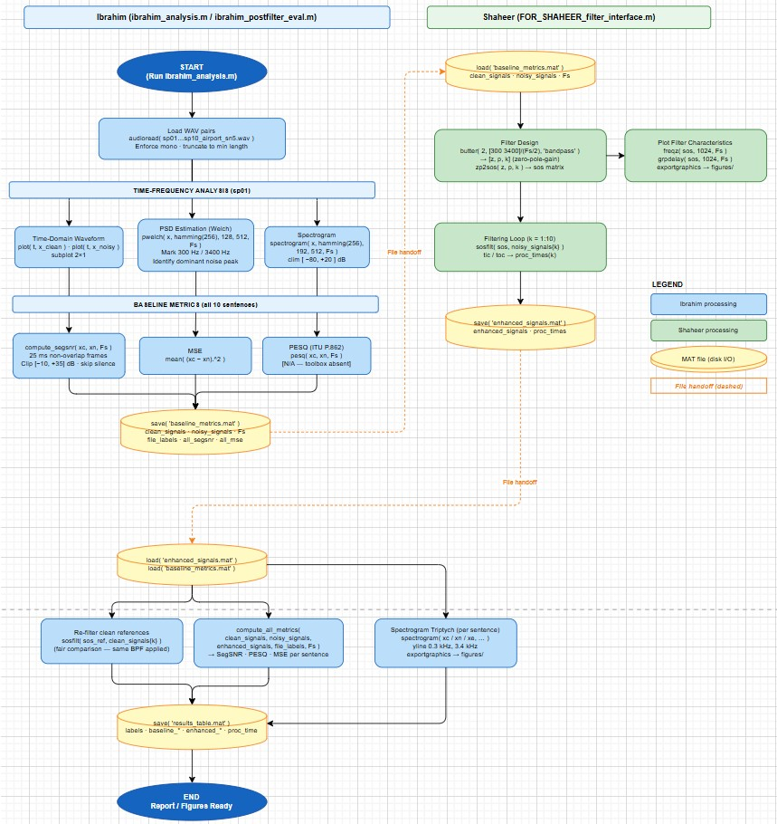

# EC-313 CEP — Airport Noise Suppression via Butterworth Bandpass Filtering

> **Course:** EC-313 Digital Signal Processing · CEME, NUST  
> **Dataset:** [NOIZEUS corpus](https://ecs.utdallas.edu/loizou/speech/noizeus/) — airport noise, 5 dB SNR, 8 kHz  
> **Group:** Aleeza Rizwan · M Ibrahim Abdullah · M Shaheer Afzal

---

## Overview

This project designs, implements, and evaluates a 2nd-order Butterworth IIR bandpass filter (300–3400 Hz) for suppressing airport ambient noise from speech recordings. Evaluation uses Segmental SNR, PESQ (ITU-T P.862), and MSE on sentences sp01–sp10 from the NOIZEUS corpus.

---

## Results

| Metric | Noisy Baseline | Enhanced Output |
|---|---|---|
| Segmental SNR (dB) | +0.184 | −0.115 |
| PESQ (MOS) | N/A¹ | N/A¹ |
| MSE | 6.48 × 10⁻⁴ | 5.71 × 10⁻⁴ |
| Mean processing time / utterance | — | 0.36 ms |

> ¹ Requires MATLAB Audio Toolbox (R2020b+). Scripts degrade gracefully to `NaN` without it.

MSE improved by **11.8%**. SegSNR marginally decreased (−0.299 dB) because the static bandpass filter does not suppress in-band noise — see [Discussion](#discussion).

---

## Repository Structure

```
project_root/
├── noizeus/
│   ├── clean/                        # sp01.wav … sp30.wav
│   └── noisy/                        # sp01_airport_sn5.wav … sp30_airport_sn5.wav
│
├── code/
│   ├── ibrahim_analysis.m            # Phase 1 — run first
│   ├── compute_segsnr.m              # Helper — do not run directly
│   ├── compute_all_metrics.m         # Helper — do not run directly
│   ├── FOR_SHAHEER_filter_interface.m  # Phase 2 template — read, copy, adapt
│   ├── ibrahim_postfilter_eval.m     # Phase 3 — run last
│   ├── baseline_metrics.mat          # Generated by Phase 1
│   ├── enhanced_signals.mat          # Generated by Phase 2
│   └── results_table.mat             # Generated by Phase 3
│
├── figures/                          # Auto-created at runtime
│   ├── sp01_timedomain.fig / .png
│   ├── sp01_psd.fig / .png
│   ├── sp01_spectrogram.fig / .png
│   └── sp01_spectrogram_comparison.fig / .png  # One set per sentence
│
└── report/
    └── EC313_CEP_Report.docx
```

---

## Pipeline

The workflow is strictly sequential. Each phase produces a `.mat` file consumed by the next.



---

## Prerequisites

- MATLAB with **Signal Processing Toolbox** (required)
- MATLAB **Audio Toolbox** (optional — for `pesq()`)
- NOIZEUS corpus downloaded from [ecs.utdallas.edu](https://ecs.utdallas.edu/loizou/speech/noizeus/)

---

## Running the Project

### 1. Set up folder structure

Place all `.m` files in `code/` and the NOIZEUS dataset in `noizeus/` as shown above.

### 2. Set the data path

Open `ibrahim_analysis.m` and update line 16:

```matlab
DATA_ROOT = '../noizeus';  % absolute path if relative doesn't resolve
```

### 3. Phase 1 — Baseline analysis (Ibrahim)

```matlab
cd('path/to/code')
ibrahim_analysis
```

Outputs: `baseline_metrics.mat` · waveform, PSD, and spectrogram figures for sp01 · console table of baseline SegSNR / PESQ / MSE.

**Share `baseline_metrics.mat` with Shaheer before he begins.**

### 4. Phase 2 — Filter design and application (Shaheer)

Read `FOR_SHAHEER_filter_interface.m` in full — it is a template, not a runnable script. Write your own filter script using its loop structure. The script must:

```matlab
% 1. Load
load('baseline_metrics.mat');

% 2. Design your filter
[z, p, k] = butter(2, [300 3400]/(Fs/2), 'bandpass');
sos = zp2sos(z, p, k);

% 3. Apply with timing — copy loop from FOR_SHAHEER_filter_interface.m
%    Save output as enhanced_signals.mat
```

**Share `enhanced_signals.mat` with Ibrahim when done.**

### 5. Phase 3 — Post-filter evaluation (Ibrahim)

Place `enhanced_signals.mat` in the `code/` folder, then:

```matlab
ibrahim_postfilter_eval
```

Outputs: `results_table.mat` · comparison table in console · 3-panel annotated spectrograms for all 10 sentences.

**Share `results_table.mat` and `figures/` with A. for the report.**

---

## File Reference

| File | Owner | Run directly? | Purpose |
|---|---|---|---|
| `ibrahim_analysis.m` | Ibrahim | Yes — first | Load corpus, generate analysis figures, compute baseline metrics |
| `compute_segsnr.m` | Ibrahim | No | Segmental SNR using 25 ms frames and Loizou silence exclusion |
| `compute_all_metrics.m` | Ibrahim | No | Batch SegSNR + PESQ + MSE for any signal set |
| `FOR_SHAHEER_filter_interface.m` | Shaheer | No — template only | Filter loop structure and `enhanced_signals.mat` save format |
| `ibrahim_postfilter_eval.m` | Ibrahim | Yes — last | Load enhanced signals, compute final metrics, generate triptych spectrograms |

---

## Filter Design Rationale

PSD analysis (Welch method, 256-sample Hamming window, 50% overlap) shows airport noise has a dominant low-frequency component below ~300 Hz (engine rumble) and broadband elevation across all frequencies. A **2nd-order Butterworth bandpass filter** at 300–3400 Hz was chosen because:

- **Butterworth** provides a maximally flat passband — no in-band ripple that would distort speech formants. Chebyshev and elliptic alternatives introduce equiripple distortion inside the passband.
- **300–3400 Hz** matches the ITU-T G.711 telephone bandwidth and the NOIZEUS recording band.
- **Order 2** provides sufficient roll-off (−40 dB at 150 Hz) without introducing excessive group delay variation or numerical instability.
- **SOS implementation** (`zp2sos` + `sosfilt`) is used instead of direct-form `[b,a]` coefficients to avoid floating-point instability at the bandpass-doubled internal polynomial order.

---

## Discussion

**Why did SegSNR decrease after filtering?**  
SegSNR measures the ratio of clean-frame energy to residual noise energy. The bandpass filter removes out-of-band noise but does not suppress in-band noise (300–3400 Hz), where airport noise substantially overlaps with speech. Minor passband-edge distortion from the filter's non-flat group delay is counted as additional noise in the metric. A fair-comparison step in `ibrahim_postfilter_eval.m` re-filters the clean references through the same bandpass before computing metrics, isolating only in-band distortion — but the in-band noise remains.

**Why did MSE improve despite SegSNR degrading?**  
MSE measures total squared error in the time domain. Removing any noise energy — even out-of-band — reduces the squared difference between clean and enhanced signals. SegSNR, by contrast, normalises per frame and is sensitive to the noise *distribution* within the speech band, not just the total energy. The two metrics capture different aspects of degradation; neither alone is sufficient.

**Limitation**  
A static bandpass filter cannot separate speech from noise within the passband. Approaches that would yield genuine SegSNR improvement include Wiener filtering with an estimated noise PSD, spectral subtraction using silence-frame noise estimation, or deep-learning-based enhancement.

---

## Metrics Reference

| Metric | Formula | What it captures |
|---|---|---|
| Segmental SNR | Mean of per-frame `10·log₁₀(E_clean / E_noise)`, clipped to [−10, +35] dB, silence frames excluded | Frame-level signal quality; weights all phonemes equally |
| PESQ (MOS) | ITU-T P.862 psychoacoustic model | Predicted human listener quality rating (1–4.5 scale) |
| MSE | `mean((clean − enhanced).²)` | Total time-domain distortion energy |

SegSNR follows the convention in Loizou (2007): 25 ms non-overlapping frames, silence exclusion at 40 dB below peak frame energy, per-frame clipping to [−10, +35] dB.

---

## Troubleshooting

| Problem | Fix |
|---|---|
| `audioread` cannot find file | Use an absolute path for `DATA_ROOT` in `ibrahim_analysis.m` |
| `pesq()` throws an error | Audio Toolbox not installed — PESQ records as `NaN`, nothing crashes |
| `load('baseline_metrics.mat')` fails | Move the `.mat` file to MATLAB's current working directory |
| `enhanced_signals.mat` not found in Phase 3 | Confirm Shaheer's script ran to completion and saved to `code/` |
| Figures open blank | Check `max(abs(x_clean))` ≈ 0.1–0.9; all-zero signal means the `.wav` path resolved incorrectly |
| SegSNR improvement is negative | In-band noise dominates; review filter cutoff frequencies or consider a more adaptive method |

---

## References

1. Y. Hu and P. C. Loizou, "Subjective evaluation and comparison of speech enhancement algorithms," *Speech Communication*, vol. 49, pp. 588–601, 2007.
2. P. Pandey et al., "Speech enhancement using classical and deep learning approaches," *Int. J. Speech Technology*, Springer, 2022.
3. N. Upadhyay et al., "Speech enhancement in multiple noise environments," *Speech Communication*, Elsevier, 2023.
4. P. C. Loizou, *Speech Enhancement: Theory and Practice*. Boca Raton, FL: CRC Press, 2007.
5. ITU-T, "Perceptual evaluation of speech quality (PESQ)," Rec. P.862, Feb. 2001.
